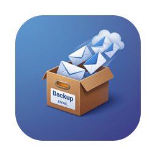
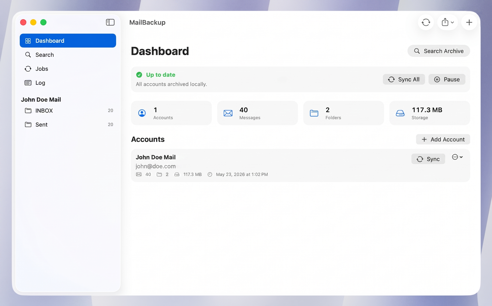

<div align="center">
  
  <h1>MailBackup</h1>
  <p><strong>Archive and back up your email locally over IMAP — a native macOS app.</strong></p>
</div>

<p align="center">
  
</p>

MailBackup connects to your IMAP accounts and keeps a local, offline copy of your
mail as standard `.eml` files, indexed for fast full-text search. Everything stays
on your Mac — nothing is sent anywhere else.

## Features

- **Multiple IMAP accounts** with provider presets (Gmail, iCloud, Outlook, Fastmail, Yahoo, Purelymail, or any custom server). SSL/TLS and STARTTLS supported.
- **Incremental sync** — UID-based, only fetches new messages; handles `UIDVALIDITY` resets. Messages are fetched with `BODY.PEEK[]`, so mail is never marked read on the server.
- **Background sync** — runs as an app-level task on a WAL-backed database, so you can browse and read already-archived mail while a sync is in progress.
- **Local storage** — each message saved as a portable `.eml` on disk; metadata and a full-text index live in SQLite.
- **Full-text search** — per-folder, or across **all accounts** from a dedicated search view.
- **Reading** — three-pane UI with an HTML message viewer that **blocks all remote content** (no tracking pixels), a Rich/Plain toggle, and savable attachments.
- **Dashboard** — sync status, summary stats (accounts, messages, folders, storage), and per-account controls.
- **Jobs & Log** — a live view of sync runs and a persistent activity log.
- **Export** — a single message as `.eml`, or a folder/account as a zipped EML archive.
- **Privacy first** — credentials are stored in the macOS **Keychain**, never on disk in plaintext.

## Install

Download the latest **`MailBackup-x.y.z.dmg`** from the [Releases page](https://github.com/moerdowo/mailbackup/releases/latest), open it, and drag **MailBackup** into your **Applications** folder. Requires macOS 14 or later (Apple Silicon).

### Opening a non-notarized build

These builds are **not notarized** (not signed with an Apple Developer certificate), so macOS Gatekeeper blocks them on first launch with a message like *"MailBackup can't be opened because Apple cannot check it for malicious software."* This is expected — open it once using any of these, and macOS remembers the choice:

- **Right-click** (or Control-click) **MailBackup.app → Open**, then click **Open** in the dialog.
- On **macOS 15 (Sequoia)** the right-click option may not appear. Try to open the app, then go to  **System Settings → Privacy & Security**, scroll to the Security section, and click **Open Anyway**.
- Or, from Terminal, clear the quarantine flag:

  ```bash
  xattr -dr com.apple.quarantine /Applications/MailBackup.app
  ```

> Prefer to verify the code yourself? Build from source (below) instead.

## Build from source

Requires [Xcode](https://developer.apple.com/xcode/) 16+ (developed against Xcode 26 / Swift 6.3) and [XcodeGen](https://github.com/yonaskolb/XcodeGen). The Xcode project is generated from [`project.yml`](project.yml) and is not checked in.

```bash
brew install xcodegen          # once
xcodegen generate              # creates MailBackup.xcodeproj
open MailBackup.xcodeproj       # then press Run in Xcode
```

Or build from the command line:

```bash
xcodebuild -project MailBackup.xcodeproj -scheme MailBackup -configuration Debug build
```

On first launch, an onboarding flow walks you through adding an account, picking
folders, choosing an archive location, and running the initial sync.

> **Tip:** for Gmail / iCloud / Outlook / Yahoo / Purelymail, use an
> **app-specific password** rather than your main account password.

## Tech stack

- **SwiftUI** + the Observation framework, macOS-native.
- **[swift-nio-imap](https://github.com/apple/swift-nio-imap)** + **[swift-nio-ssl](https://github.com/apple/swift-nio-ssl)** for a pure-Swift async IMAP client over TLS.
- **[GRDB](https://github.com/groue/GRDB.swift)** for SQLite with an FTS5 full-text index, in WAL mode.
- A small built-in MIME / RFC 2047 parser for extracting searchable text, HTML bodies, and attachments.

## Architecture

```
Sources/MailBackup/
├── App/          AppModel (root state), ActivityLog, RootView
├── Onboarding/   Multi-step setup wizard
├── Main/         3-pane window: Dashboard, Search, Jobs, Log, message viewer
├── IMAP/         Async IMAP client built on swift-nio-imap
├── Sync/         SyncEngine — incremental UID sync orchestration
├── Mail/         MIME + RFC 2047 parsing
├── Storage/      GRDB database, repository, .eml ArchiveStore, Keychain
└── Models/       Account, Folder, Message, and view models
```

The app stores its database and `.eml` archive under
`~/Library/Application Support/MailBackup` (the archive location is configurable
during onboarding).

## Development smoke tests

A few self-checks are wired into the binary behind environment variables and exit
after running:

```bash
APP="$(find ~/Library/Developer/Xcode/DerivedData/MailBackup-*/Build/Products/Debug -name MailBackup -path '*MacOS*' | head -1)"

MAILBACKUP_STORAGE_TEST=1 "$APP"   # migrations, .eml roundtrip, FTS, Keychain
MAILBACKUP_MIME_TEST=1    "$APP"   # MIME / RFC 2047 parsing
MAILBACKUP_EXPORT_TEST=1  "$APP"   # .eml + zip export

# Read-only end-to-end IMAP check (uses your own credentials, nothing is stored):
MAILBACKUP_IMAP_HOST=imap.fastmail.com \
MAILBACKUP_IMAP_USER=you@example.com \
MAILBACKUP_IMAP_PASS='app-password' \
"$APP"
```

## Privacy & security

- All mail is stored locally; nothing is uploaded or shared.
- Passwords live in the macOS Keychain.
- The HTML viewer blocks every network request, so remote/tracking content never loads.

## Status

This is an early, actively developed project. Contributions and issues are welcome.
